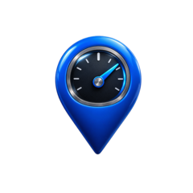

<p align="center">
  
</p>

<h1 align="center">MeterPod</h1>
<p align="center"><i>Android, Kotlin</i></p>

<p align="center">
  <a href="https://github.com/karthikhegde25/MeterPod/releases/download/1.0/MeterPod.apk">
    
  </a>
</p>

A six-tab sensor toolbox: **Angle** (corner/edge protractor + slope),
**Digital Level** (bubble level with X/Y tilt readouts), **Compass**
(magnetic heading), **Metal Detector** (magnetometer field-strength
anomaly detection + rough direction arrow), **Speed** (GPS-based
speedometer), and **Sound Level** (mic-based dB meter, dominant frequency,
and live waveform). The first three use only built-in motion/position
sensors and need no runtime permissions; Metal Detector uses the
vibration motor for feedback (normal permission, no prompt); Speed and
Sound Level each need a runtime permission (location, microphone),
requested the first time you open that tab.

## Tabs

### Angle
Rest any corner or edge of the phone on the ground and read the acute
angle live, plus the slope (rise/run ratio) that angle corresponds to.

The app reads the phone's Z-axis (screen-normal) component of gravity,
low-pass filters it to remove jitter, and computes:

```
angleFromVerticalZ = acos(gz / |g|)
planeAngle = min(angleFromVerticalZ, 180 - angleFromVerticalZ)
slope = tan(planeAngle)          // e.g. 45° -> 1.00 (100%)
```

`planeAngle` is the acute angle (0°–90°) between the phone's flat plane
and the ground plane. It works for any corner/edge and any compass
heading, since it only depends on tilt, not rotation about the vertical
axis. Slope is shown both as a decimal ratio and a percentage, and reads
"vertical (∞)" once the angle gets within half a degree of 90°, since the
ratio is unbounded there.

- `AngleFragment.kt` — sensor reading, filtering, angle + slope calc.
- `ui/AngleDialView.kt` — custom-drawn protractor/needle visual.
- `res/layout/fragment_angle.xml` — tab layout.

### Digital Level
Lay the phone flat and it reports X tilt (roll), Y tilt (pitch), and a
combined value, plus a bubble-level visual that turns green when level.
Stand the phone on an edge against a wall and the same readouts tell you
whether that surface is plumb (vertical) — status text switches between
`LEVEL · HORIZONTAL`, `PLUMB · VERTICAL`, and `TILTED` automatically.

- `LevelFragment.kt` — sensor reading, roll/pitch calc, status logic.
- `ui/BubbleLevelView.kt` — custom-drawn bubble level visual.
- `res/layout/fragment_level.xml` — tab layout.

### Compass
Shows the current magnetic heading in degrees plus its cardinal
abbreviation (N, NE, E, SE, S, SW, W, NW), with a rotating compass-rose
dial. The dial rotates opposite to the device heading so the "N" label
always points at magnetic north; a fixed blue triangle at the top of the
dial always represents the direction the top of the phone is facing.

Heading comes from `Sensor.TYPE_ROTATION_VECTOR` where available — a
fused sensor (accelerometer + magnetometer + gyroscope where present)
that's much less jittery than raw magnetometer readings. On devices
without it, the fragment falls back to combining raw accelerometer +
magnetometer data via `SensorManager.getRotationMatrix` /
`getOrientation`. Either way, heading is angle-wrapped low-pass filtered
(handles the 359°→0° crossing without a visible snap) before being shown.

This shows **magnetic** north, not true north — no magnetic declination
correction is applied. Accuracy also degrades near large metal objects,
electronics, or magnets, same as any phone compass.

- `CompassFragment.kt` — sensor reading (with fallback), heading calc,
  angle-wrapped smoothing, cardinal direction lookup.
- `ui/CompassView.kt` — custom-drawn rotating compass rose.
- `res/layout/fragment_compass.xml` — tab layout.

### Metal Detector
Reads the magnetometer's raw field **vector** (not just heading, which the
Compass tab uses) and compares it against a calibrated baseline vector.
Tap "Calibrate baseline" somewhere away from metal or magnets, then sweep
the phone near an object — the reading, delta, and intensity bar update
live, with status text stepping through `NO METAL DETECTED` →
`METAL NEARBY` → `STRONG SIGNAL`, plus a short vibration pulse on a
strong signal.

**Direction arrow:** a single 3-axis magnetometer can't triangulate a
precise bearing to a metal object — that needs multiple sensor positions
or a proper gradiometer. What it *can* do is show which way, within the
phone's own flat plane, the field deviation is strongest, which is the
same heuristic hobbyist detector apps use. Hold the phone flat/level while
sweeping (like a real detector wand) for the arrow to mean anything; it
greys out below a small deviation threshold so it doesn't spin randomly
on noise.

This is inherently approximate: phone magnetometers are small, noisy, and
every phone/location has a different ambient baseline — that's why it's
calibrate-then-compare rather than a fixed threshold. It's good for
"is there something metallic near this specific spot, and roughly which
way" (studs in a wall, a dropped screw), not precision depth/size
detection or an exact bearing.

- `MetalDetectorFragment.kt` — field vector tracking, calibration, status
  thresholds, bearing calc, vibration feedback.
- `ui/MetalDetectorView.kt` — custom-drawn intensity bar.
- `ui/MetalDirectionView.kt` — custom-drawn direction arrow.
- `res/layout/fragment_metal_detector.xml` — tab layout.

### Speed
GPS-based speedometer for use in a moving vehicle (car, bike, train,
etc.). Android's Location API reports speed directly (`Location.speed`,
in m/s) whenever the GPS provider has a confident fix, which this
converts to km/h and mph on a speedometer-style gauge. Also tracks a
session max speed (with a reset button), similar to a real speedometer's
peak-hold.

- Requests `ACCESS_FINE_LOCATION` at runtime via
  `registerForActivityResult`/`ActivityResultContracts.RequestPermission`.
- Prompts to enable device Location/GPS if it's turned off
  (`Settings.ACTION_LOCATION_SOURCE_SETTINGS`).
- Falls back to computing speed from distance/time between consecutive
  fixes if a given fix doesn't directly report speed (rare for
  `GPS_PROVIDER`, more common on network-based fixes).
- Shows current GPS accuracy so you know how much to trust the reading;
  best accuracy (and thus best speed readings) needs open sky, so it's
  noticeably less accurate indoors, in tunnels, or in dense cities.

- `SpeedFragment.kt` — location updates, permission handling, speed calc,
  session max tracking.
- `ui/SpeedGaugeView.kt` — custom-drawn semi-circle speedometer gauge.
- `res/layout/fragment_speed.xml` — tab layout.

### Sound Level
Ambient sound level meter with three live readouts derived from the same
audio capture: a dB figure, a dominant frequency estimate, and a raw
waveform graph.

- **dB level**: relative peak-amplitude measurement (`20*log10` of the raw
  sample amplitude), smoothed, with a session peak-hold (reset button
  included). This is an uncalibrated approximation, not a certified SPL
  reading — consumer phone microphones and their gain staging vary
  significantly between models with no standard reference, so treat it as
  "louder vs quieter" and rough ballpark, not anything safety- or
  regulation-critical.
- **Frequency**: a real-input FFT (`AudioAnalyzer.kt` implements a
  standard iterative radix-2 Cooley-Tukey FFT directly, no external DSP
  library) over a Hann-windowed 1024-sample buffer, reporting the
  strongest frequency bin only when it clearly stands out from the
  average — otherwise it shows "—" rather than a meaningless number for
  silence or broadband noise.
- **Waveform**: the raw captured samples drawn as a simple oscilloscope-
  style line graph, refreshed live.

Audio capture runs on its own background thread
(`AudioAnalyzer.captureLoop`) using `AudioRecord` directly rather than
`MediaRecorder`, since we need raw PCM samples for the FFT and waveform,
not just a rolling amplitude figure. Results are throttled to ~15 fps and
delivered back to the fragment on the main thread.

- `audio/AudioAnalyzer.kt` — `AudioRecord` capture thread, FFT, amplitude
  calc, result throttling.
- `SoundLevelFragment.kt` — permission handling, UI updates from analyzer
  results.
- `ui/SoundLevelView.kt` — custom-drawn horizontal level bar with peak
  marker.
- `ui/WaveformView.kt` — custom-drawn oscilloscope-style waveform.
- `res/layout/fragment_sound_level.xml` — tab layout.

All six tabs share the same low-pass filtering approach (`filterAlpha`
in each fragment controls smoothing) and each registers/unregisters its
sensor/location/audio listener(s) in `onResume`/`onPause` so only the
tab is actively reading sensors.

## About screen
The top bar (above the tabs) has the app logo, title, and a three-dot
overflow button. Tapping it shows a single **About** entry, which opens a
dialog with the developer name, a note that the app is open source and
vibe-coded, and a tappable link to the GitHub repo
(https://github.com/karthikhegde25/MeterPod) — tapping "Open repo" in the
dialog launches it in the browser.

- `MainActivity.kt` — overflow menu handling + About dialog.
- `res/menu/main_menu.xml` — the single-item overflow menu.

## Branding
- Package name / applicationId: `com.karthikhegde.meterpod`
- App name: `MeterPod`
- Launcher icon: a real Android adaptive icon —
  `res/mipmap-anydpi-v26/ic_launcher.xml` layers a solid black background
  (`@color/ic_launcher_background`) with a colored foreground
  (`res/drawable/ic_launcher_foreground.png`, the blue gauge/pin logo) and
  a white monochrome layer (`res/drawable/ic_launcher_monochrome.png`) for
  Android 13+ themed icons. Both layers were cut out via flood-fill
  background removal (not a color-threshold, so interior highlights on the
  glossy pin survive) and padded to the standard ~66%-of-canvas safe zone
  so OEM icon masks (circle, squircle, rounded-square, etc.) don't clip
  the artwork.
- Legacy fallback for API 24-25 (pre-adaptive-icon): flattened square PNGs
  at `res/mipmap-*dpi/ic_launcher.png`, each resized directly from the
  full-resolution source (not chained through smaller intermediates) to
  stay sharp rather than accumulating resampling blur.

## App structure
- `MainActivity.kt` — hosts a `TabLayout` + `ViewPager2` with six tabs
  ("Angle", "Digital Level", "Compass", "Metal Detector", "Speed",
  "Sound Level"); the tab bar is scrollable since six labels don't all
  fit at once.
- `MainPagerAdapter.kt` — `FragmentStateAdapter` supplying `AngleFragment`,
  `LevelFragment`, `CompassFragment`, `MetalDetectorFragment`,
  `SpeedFragment`, and `SoundLevelFragment` to the pager.
- `res/layout/activity_main.xml` — the tab host layout (TabLayout on top,
  ViewPager2 filling the rest).

## How to open and run it
1. Open **Android Studio** (Hedgehog/2023.1 or newer works well).
2. **File → Open** and select this `MeterPod` folder.
3. If Android Studio asks to create a Gradle wrapper, let it — it will
   sync automatically using its bundled Gradle. (If you'd rather use
   your own wrapper, run `gradle wrapper` once inside this folder from
   a terminal that has Gradle installed.)
4. Plug in an Android phone (USB debugging enabled) or start an
   emulator with sensor support, then click **Run ▶**.

Minimum SDK: Android 7.0 (API 24). No runtime permissions are required.

## Continuous Integration
`.github/workflows/build.yml` builds a debug APK on every push/PR to
`main` (and on manual trigger), uploading it as a downloadable workflow
artifact named `app-debug`.

Note: this project doesn't include a Gradle wrapper (`gradlew` +
`gradle-wrapper.jar`), so the workflow installs a pinned Gradle 8.5
directly via `gradle/actions/setup-gradle` and runs `gradle assembleDebug`
instead of `./gradlew assembleDebug`. It also auto-detects whether the
project was committed as a zip or already extracted, and locates
`settings.gradle` wherever it ends up. If you later generate a real
wrapper (open the project in Android Studio and let it sync, or run
`gradle wrapper` locally with Gradle installed), you can simplify the
workflow to the more common `./gradlew assembleDebug` form.

## QR Generator
Builds a scannable QR code from nine content types — plain text, website
URL, Wi‑Fi network, phone number, SMS, email, geo location, contact card
(vCard), and calendar event — with adjustable foreground/background
colors, dot shape (square/rounded/circle), error-correction level, and an
optional center logo. Results can be saved to the gallery or shared.

- `QrGeneratorFragment.kt` — content-type form, style controls, save/share.
- `qr/QrPayloadBuilder.kt` — builds the raw payload string for each content
  type (`WIFI:`, `SMSTO:`, `geo:`, `MATMSG:`, `tel:`, `VCARD`, `VEVENT`).
- `qr/QrCodeRenderer.kt` — encodes with ZXing and hand-draws the styled
  bitmap (color, dot shape, logo).
- `qr/QrFileSaver.kt` — gallery save (MediaStore) and share (FileProvider).
- `res/layout/fragment_qr_generator.xml` — tool layout.

## Credits
The QR Generator tool's set of content types and the exact code format
each one encodes are adapted from
[Image Toolbox](https://github.com/T8RIN/ImageToolbox)'s QR code feature,
so codes generated here scan correctly there (and in any standard QR
reader) too. Thanks to the Image Toolbox project and its contributors.

